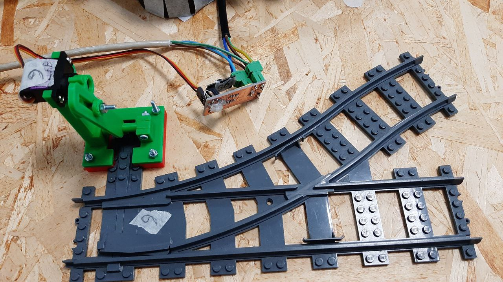
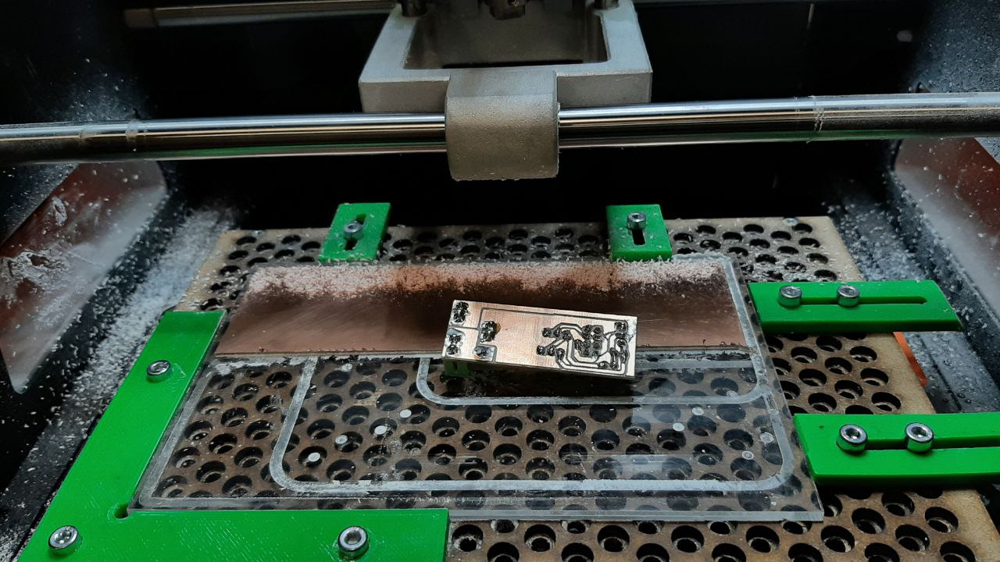

# ESP8266 Rail Track Switch Control System

This section of the repository contains the source code for an ESP-8266-based rail track switch control system. The code enables the ESP8266 to function as a web server, offering control over a servo-driven rail track switch. It is designed to set the correct path for trains.



## Features
- The ESP8266 uses a REST API to interface with the other components of the project.
- Switch control commands can be transmitted via HTTP POST requests.

## Hardware
- The system utilizes a Servo motor (specifically, the MSG90S) to control the position of the rail track switch.
- WiFi connectivity is established using the built-in wireless functionality of the `ESP-8266` module.

## Code Overview
- The code includes essential libraries such as `ESP8266WiFi`, `WiFiClient`, `ESP8266WebServer`, `Arduino`, `Servo`, and `ArduinoJson`.
- Switch positions are defined based on user-configurable constants.
- The web server responds to HTTP GET requests with information about the switch and handles HTTP POST requests to control the switch position.

## Requirements
- [PlatformIO](https://platformio.org/platformio-ide) (Follow the [guide to download and configure](https://docs.platformio.org/en/latest/core/installation/index.html))
- PlatformIO compiler toolchain (Download [here](https://registry.platformio.org/platforms/platformio/espressif8266/installation))

## Configuration
1. Modify the WiFi credentials by adjusting the `STASSID` and `STAPSK` constants.
2. Specify the switch characteristics by defining the switch name and position angles for the servo in the code.
   (In our demo it is possible to select one of the predefined configurations of the six switches present on the map, using a compiler directive modifiable in the [platformio.ini](./platformio.ini))

## Usage
1. Connect the `ESP-8266` to the rail track switch control mechanism.
2. Flash the firmware using this command:  
   ```bash
      platformio run --target upload`
   ```
### Troubleshooting
#### If a library is not found
1. Run:  
    ```bash
    pio lib install
    pio update
    ```
#### If PlatformIO is not found
1. Ensure that PlatformIO and the toolchain are installed correctly.
2. Verify that the PlatformIO global variable is set.  
   Command:
   ```bash
      source /your_local_path_to/ENV/bin/activate
   ```
## Supported Hardware Parts:
>[!CAUTION]
>⚠️ **BASIC CNC AND ELECTRONICS KNOWLEDGE IS NEEDED TO REPRODUCE BELOW STEPS** ⚠️
### PCB
Files to create the PCBs are located [here](./hardware/Switch_PCB).
#### To Design and Mill a PCB:
You will require the following software:
- [KiCad](https://www.kicad.org/)
- [FlatCAM](http://flatcam.org/)
- GRBL Controller, like [Candle](https://github.com/Denvi/Candle)

#### To mill the PCB of the Switch:
>[!IMPORTANT]
>GRBL Controller or a GCode for CNC/NC controller for your CNC is required.
1. Download the .nc files from [here](./hardware/Switch_PCB/FlatCAM/OutputFiles)
2. Load in the _CNC Program_ / _NC Code Feeder_ the [file](./hardware/Switch_PCB/FlatCAM/OutputFiles/Switch_PCB_ESP01-F_Cu.gbr_cnc_file.nc) with _F_Cu_ in his name, to make the isolation of the traces of the PCB circuit.
3. Then load in this sequence, the following files: [0.8mm](./hardware/Switch_PCB/FlatCAM/OutputFiles/Switch_PCB_ESP01-PTH_0.8mm.drl_cnc.nc), [1.0mm](./hardware/Switch_PCB/FlatCAM/OutputFiles/Switch_PCB_ESP01-PTH_1.0mm.drl_cnc.nc), [Edge_Cuts](./hardware/Switch_PCB/FlatCAM/OutputFiles/Switch_PCB_ESP01-Edge_Cuts.gbr_cutout_cnc.nc).

___
### Images for reference

<p float="left">
   
   
</p>


